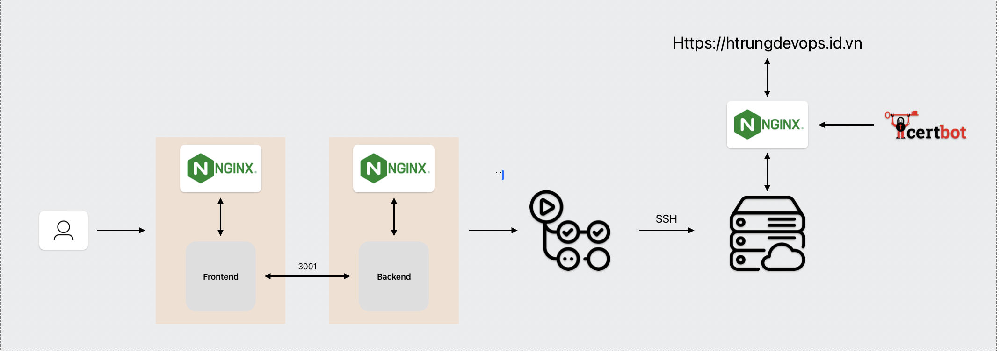

<a name="readme-top"></a>
<!-- ABOUT THE PROJECT -->
## About The Project



The CowDevOps project serves as a personal Devops project, by building infrastructure, deploying both frontend and backend automatically. 


### Built With
- Frontend: NextJS
- Backend: REST API
- Security: UFW, Certbot
- CICD: Github Actions
- Virtualization: Vagrant
- Loadbalancer: Nginx


<!-- GETTING STARTED -->
## Getting Started

This is an example of how you may give instructions on setting up your project locally.
To get a local copy up and running follow these simple example steps.

### Installation

1. Bought a custom domain at [Namecheap](https://namecheap.com/)
2. Setup VM using Vagrant

    ```
    vagrant up
    vagrant ssh
    ```
    2.1 Install Node/NPM
    ```
    curl -sL https://deb.nodesource.com/setup_12.x | sudo -E bash -

    sudo apt install nodejs

    node --version
    ```

    2.2 Setup PM2 process manager to keep your app running
    ```
    sudo npm i pm2 -g

    # Other pm2 commands
    pm2 show app
    pm2 status
    pm2 restart app
    pm2 stop app
    pm2 logs (Show log stream)
    pm2 flush (Clear logs)

    # To make sure app starts when reboot
    pm2 startup ubuntu
    ```

    2.3 Clone your project from Github
    
    ```
    git clone https://github.com/htrungngx/CowDevOps.git
    ```

    2.4 Install dependencies and test app
    ```
    cd CowDevOps/Backend ## Run Backend
    npm install.
    pm2 start npm --name 'Backend' -- run dev

    cd .. && cd Frontend ## Run Frontend
    npm install
    npm run build
    
    pm2 start npm --name 'Frontend' -- start
    
    # Kill all process
    pm2 kill
    ```

    2.5 Install NGINX and configure
    ```
    sudo apt install nginx

    sudo nano /etc/nginx/sites-available/Cowdevops
    ```

        server {
            listen 80;
            listen [::]:80;
            server_name htrungdevops.id.vn  www.htrungdevops.id.vn;

            location / {
                proxy_pass http://localhost:3000;
                proxy_http_version 1.1;
                proxy_set_header Upgrade $http_upgrade;
                proxy_set_header Connection 'upgrade';
                proxy_set_header Host $host;
                proxy_cache_bypass $http_upgrade;
            }
            location /api {
                proxy_pass http://localhost:3001;
                proxy_http_version 1.1;
                proxy_set_header Upgrade $http_upgrade;
                proxy_set_header Connection 'upgrade';
                proxy_set_header Host $host;
                proxy_cache_bypass $http_upgrade;
            }
        }
    
    ```
    # Check Nginx configuration
    sudo nginx -t

    # Create symbol link
    ln -s /etc/nginx/sites-available/Cowdevops /etc/nginx/sites-enabled/Cowdevops

    # Restart NGINX
    sudo service nginx restart
    ```

    2.6 Setup ufw firewall
    ```
    sudo ufw enable
    sudo ufw status
    sudo ufw allow ssh (Port 22)
    sudo ufw allow http (Port 80)
    sudo ufw allow https (Port 443)
    sudo ufw allow NGINX full
    sudo reload ufw
    ```
    ### You should now be able to visit your IP with no port (port 80) and see your app. Now let's add a domain

    2.7 Configure DNS for domain on domain's configuration site


    2.8 Add SSL with Certbot
    ```
    sudo add-apt-repository ppa:certbot/certbot
    sudo apt-get update
    sudo apt-get install python-certbot-nginx
    sudo certbot --nginx -d htrungdevops.id.vn -d www.htrungdevops.id.vn

    # Only valid for 90 days, test the renewal process with
    certbot renew --dry-run
    ```

    Now visit https://htrungdevops.id.vn and you should see your Node app


3. Setup Github Actions

In Repo, under Settings/Secrets and Variables/Action, Create following secrets

- HOST = VM public ip address
- HOST_NAME = username of VM
- KEY = Private key to VM

Create `cicd.yaml` under `.github/workflow`

   ```yaml
   name: Full cicd 

    on:
    push:
        branches:
        - main
    jobs:
    build:
        runs-on: ubuntu-latest
        steps:
        - name: Initial SSH Connection
            uses: appleboy/ssh-action@v1.0.0
            with: 
            host: ${{ secrets.HOST }}
            username: ${{ secrets.HOSTNAME }}
            key: ${{ secrets.VM_KEY }}
            script: |
                PROJECT_DIR='CowDevOps'
                PROJECT_REPO='https://github.com/htrungngx/CowDevOps.git'

                if [ ! -d "$PROJECT_DIR" ]; then
                    echo "$PROJECT_DIR directory not found. Cloning repository..."
                    git clone $PROJECT_REPO
                    cd $PROJECT_DIR
                else
                    echo "$PROJECT_DIR directory found. Pulling latest changes..."
                    cd $PROJECT_DIR
                    git stash
                    git pull
                fi
                whoami
                
                chmod +x deploy.sh
                ./deploy.sh     
   ```

